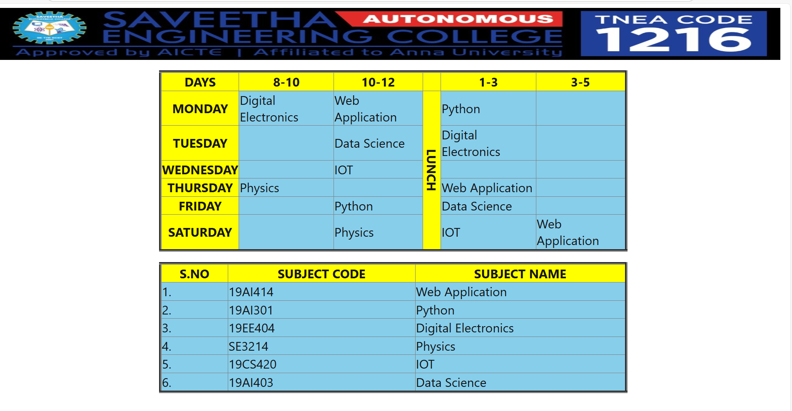

# Ex03 Time Table
# Date:
# AIM
To write a html webpage page to display your slot timetable.

# ALGORITHM
## STEP 1
Create a Django-admin Interface.

## STEP 2
Create a static folder and inert HTML code.

## STEP 3
Create a simple table using `<table>` tag in html.

## STEP 4
Add header row using `<th>` tag.

## STEP 5
Add your timetable using `<td>` tag.

## STEP 6
Execute the program using runserver command.

# PROGRAM
views.py
```
from django.shortcuts import render
def table(request):
    return render(request,'Untitled-1.html')

```
settings.py
```

from pathlib import Path

BASE_DIR = Path(__file__).resolve().parent.parent


SECRET_KEY = 'django-insecure-#tfniv$%de1)bsc!s^fv&a41#l^5s2xuxs*whu&$@ih)u%ds-*'


DEBUG = True

ALLOWED_HOSTS = []


INSTALLED_APPS = [
    'django.contrib.admin',
    'django.contrib.auth',
    'django.contrib.contenttypes',
    'django.contrib.sessions',
    'django.contrib.messages',
    'django.contrib.staticfiles',
    'timetable',
]

MIDDLEWARE = [
    'django.middleware.security.SecurityMiddleware',
    'django.contrib.sessions.middleware.SessionMiddleware',
    'django.middleware.common.CommonMiddleware',
    'django.middleware.csrf.CsrfViewMiddleware',
    'django.contrib.auth.middleware.AuthenticationMiddleware',
    'django.contrib.messages.middleware.MessageMiddleware',
    'django.middleware.clickjacking.XFrameOptionsMiddleware',
]

ROOT_URLCONF = 'experiment.urls'

TEMPLATES = [
    {
        'BACKEND': 'django.template.backends.django.DjangoTemplates',
        'DIRS': [],
        'APP_DIRS': True,
        'OPTIONS': {
            'context_processors': [
                'django.template.context_processors.debug',
                'django.template.context_processors.request',
                'django.contrib.auth.context_processors.auth',
                'django.contrib.messages.context_processors.messages',
            ],
        },
    },
]

WSGI_APPLICATION = 'experiment.wsgi.application'


DATABASES = {
    'default': {
        'ENGINE': 'django.db.backends.sqlite3',
        'NAME': BASE_DIR / 'db.sqlite3',
    }
}


AUTH_PASSWORD_VALIDATORS = [
    {
        'NAME': 'django.contrib.auth.password_validation.UserAttributeSimilarityValidator',
    },
    {
        'NAME': 'django.contrib.auth.password_validation.MinimumLengthValidator',
    },
    {
        'NAME': 'django.contrib.auth.password_validation.CommonPasswordValidator',
    },
    {
        'NAME': 'django.contrib.auth.password_validation.NumericPasswordValidator',
    },
]


LANGUAGE_CODE = 'en-us'

TIME_ZONE = 'UTC'

USE_I18N = True

USE_TZ = True


STATIC_URL = 'static/'


DEFAULT_AUTO_FIELD = 'django.db.models.BigAutoField'

```
urls.py
```
"""
from django.contrib import admin
from django.urls import path
from timetable import views

urlpatterns = [
   # path('admin/', admin.site.urls),
   path('timetable',views.table)
]

```
timetable
```
<html>
    <head>
        <title>TIME TABLE</title>
        <style>
            table{
                 border-collapse: collapse;
                 margin-top: 100px;
                 color: rgba(16, 15, 15, 0.978);
                 font-family: 'Segoe UI', Tahoma, Geneva, Verdana, sans-serif;
                 font-size: x-large;
            }
            th{
                background-color: yellow;
                text-transform: uppercase;
            }
            td{
               background-color: skyblue;
            }
       </style> 
    </head>
    <table>
    <body>
        

        
        <table border="5px"width="130"align="center" cellpadding="15px">
        <tr>
        <th>Days</th>
        <th>8-10</th>
        <th>10-12</th>
        <th></th>
        <th>1-3</th>
        <th>3-5</th>
        </tr>
        <tr>
            <th>Monday</th>
            <td>Digital Electronics</td>
            <td>Web Application</td>
            <th rowspan="7" style="writing-mode: vertical-rl;">LUNCH</th>
            <td>Python</td>
            <td></td>
        </tr>
        <tr>
            <th>Tuesday</th>
            <td></td>
            <td>Data Science</td>
            <td>Digital Electronics</td>
            <td></td>
        </tr>
        <tr>
            <th>Wednesday</th>
            <td></td>
            <td>IOT</td>
            <td></td>
            <td></td>
        </tr>
        <tr>
            <th>Thursday</th>
            <td>Physics</td>
            <td></td>
            <td>Web Application</td>
            <td></td>
        </tr>
        <tr>
            <th>Friday</th>
            <td></td>
            <td>Python</td>
            <td>Data Science</td>
            <td></td>
        </tr>
        <tr>
            <th>Saturday</th>
            <td></td>
            <td>Physics</td>
            <td>IOT</td>
            <td>Web Application</td>
        </tr>
    </table>
    <table>
       <table
        border="5px"width="150"align="center" cellpadding="15px">
        <tr>
            <th>S.NO</th>
            <th>SUBJECT CODE</th>
            <th>SUBJECT NAME</th>
        </tr>
        <tr>
            <td>1.</td>
            <td>19AI414</td>
            <td>Web Application</td>
        </tr>
        <tr>
            <td>2.</td>
            <td>19AI301</td>
            <td>Python</td>
        </tr>
        <tr>
            <td>3.</td>
            <td>19EE404</td>
            <td>Digital Electronics</td>
        </tr>
        <tr>
            <td>4.</td>
            <td>SE3214</td> 
            <td>Physics</td>
        </tr>
        <tr>
            <td>5.</td>
            <td>19CS420</td>
            <td>IOT</td>
        </tr>
        <tr>
            <td>6.</td>
            <td>19AI403</td>
            <td>Data Science</td>
        </tr>
    </table>
    </body>
</html>
```
# OUTPUT

# RESULT
The program for creating slot timetable using basic HTML tags is executed successfully.
